Домашнее задание

Создан внешний хост IP 84.252.129.211  пользователь centos  +  сертификат для netology
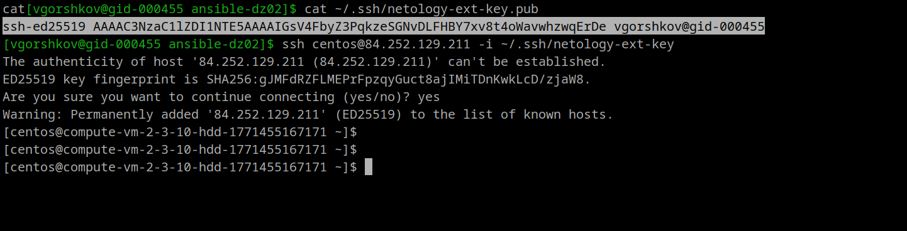

Внесен в inventory
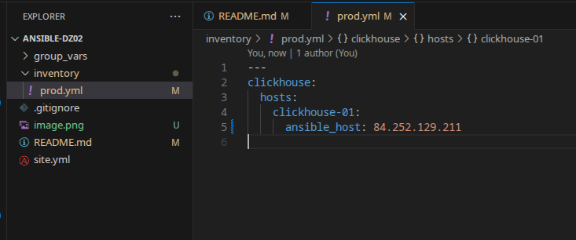

Прописал креды, готов запускать.
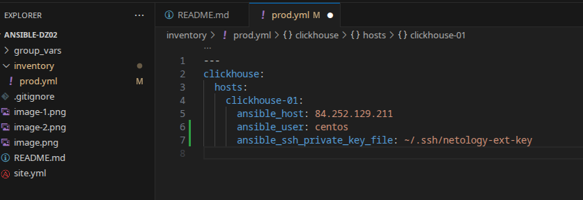

Пинг - ок

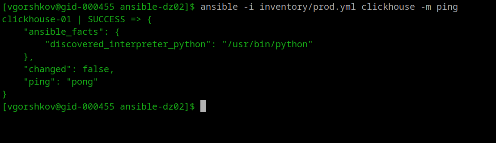

Видим что он скачал версию для x86 и выполнился успешно.
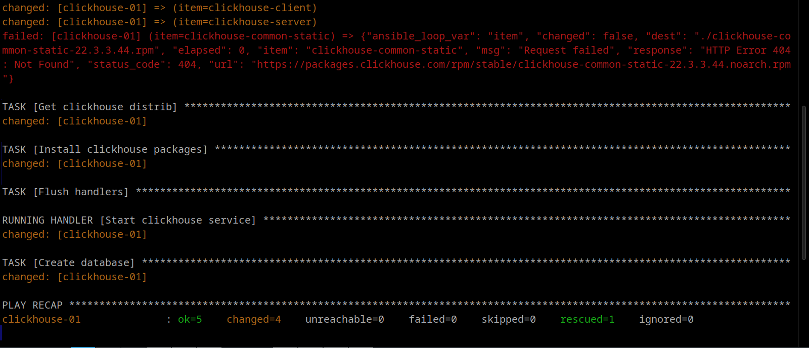

Добавление хоста Vector:
Добавили в инвентори
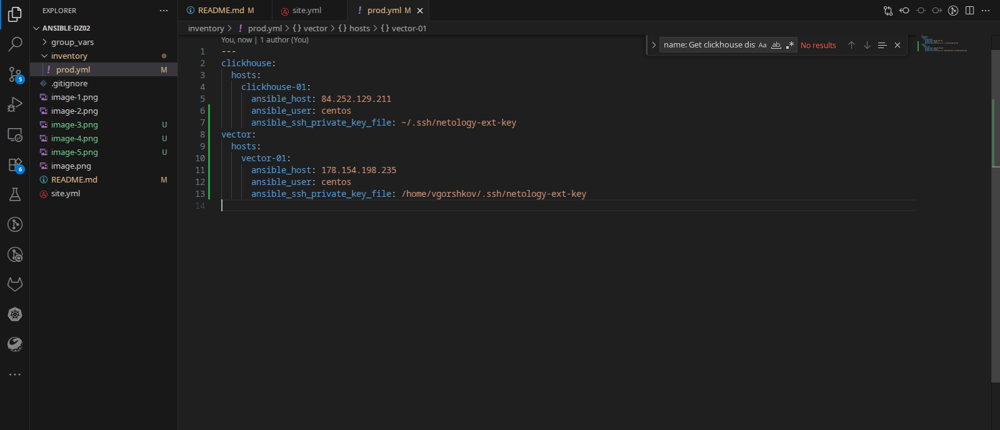

Проверяем связь - ok.
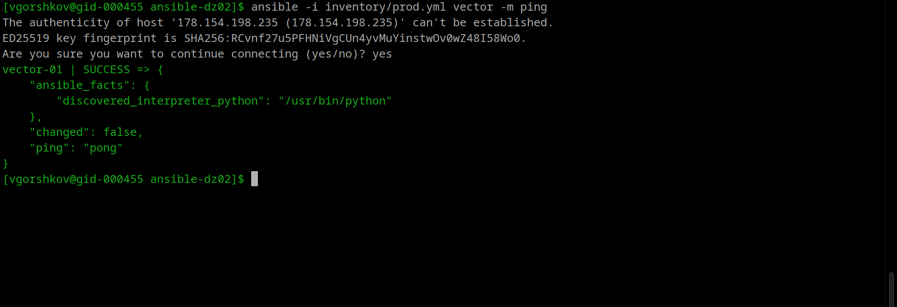

Проверка конфига:
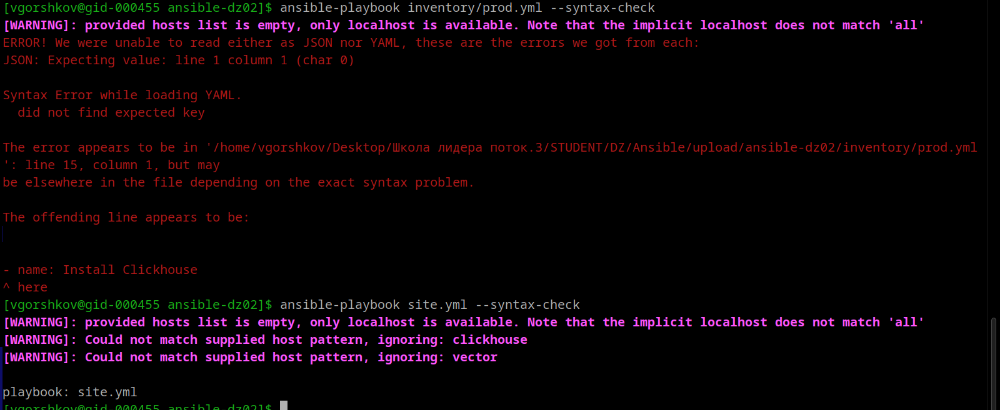
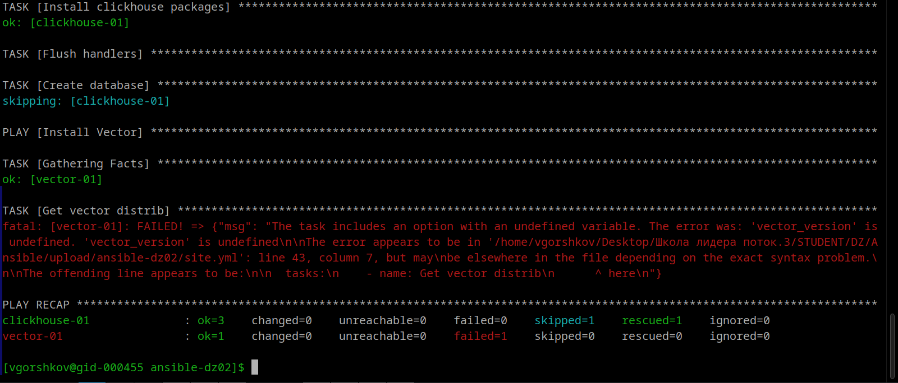
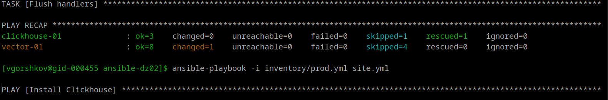

Запуск playbook Tasks должны: скачать дистрибутив нужной версии, выполнить распаковку в /home/centos, установить vector.
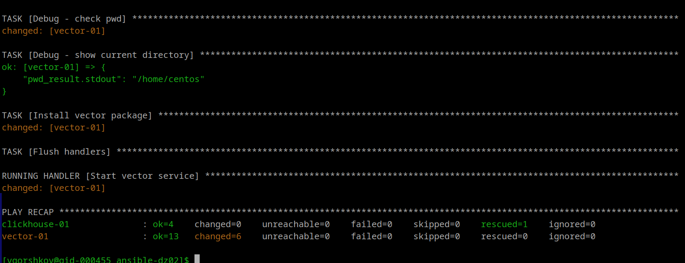

Установка ansible lint  
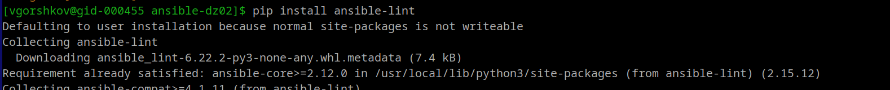
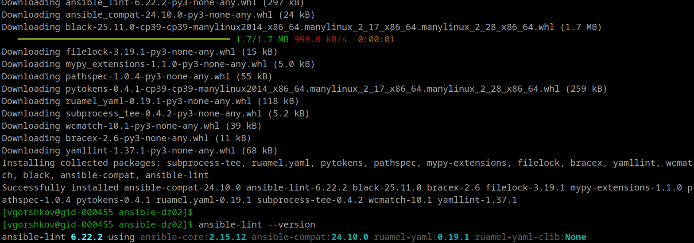

Проверка показала наличие нескольких видов ошибок. Исправляем.

Часть ошибок пофикшено:
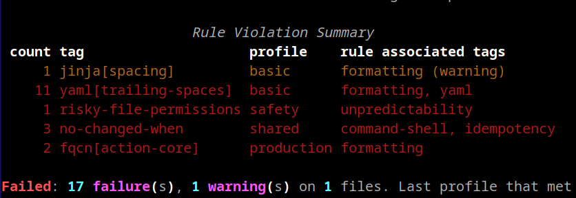
и еще:

Готово:
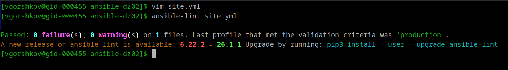

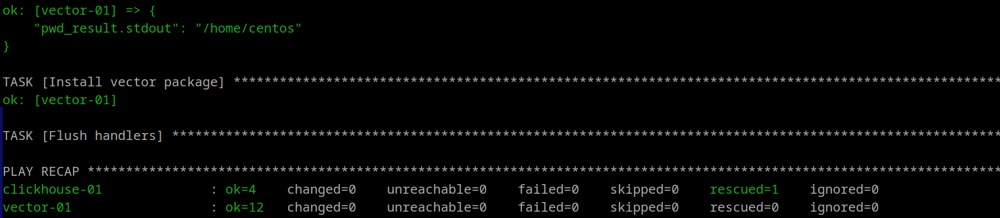

Запуск с флагом --check
ansible-playbook -i inventory/prod.yml site.yml --check

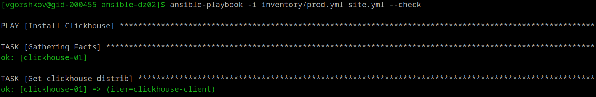
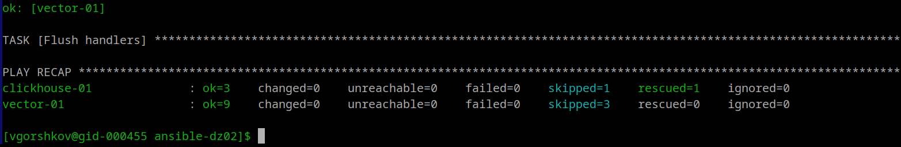

Запуск с флагом  --diff
ansible-playbook -i inventory/prod.yml site.yml --diff

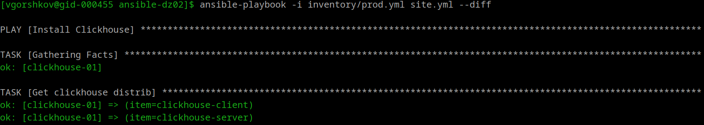
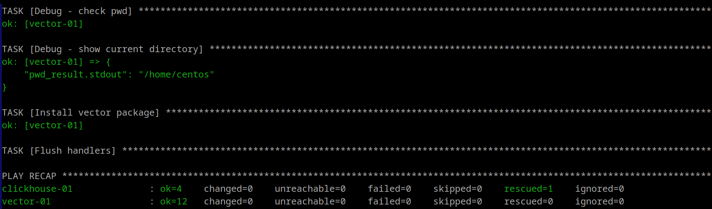

Запускаем и смотрим иденпотентен ли playbook

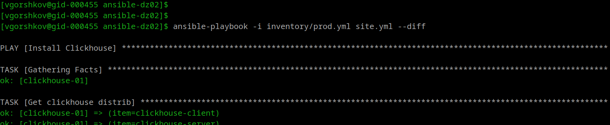
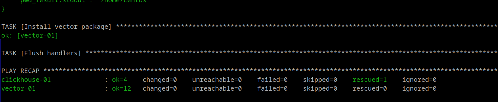

https://github.com/vegorshkov/ansible-dz02/tree/08-ansible-02-playbook 

